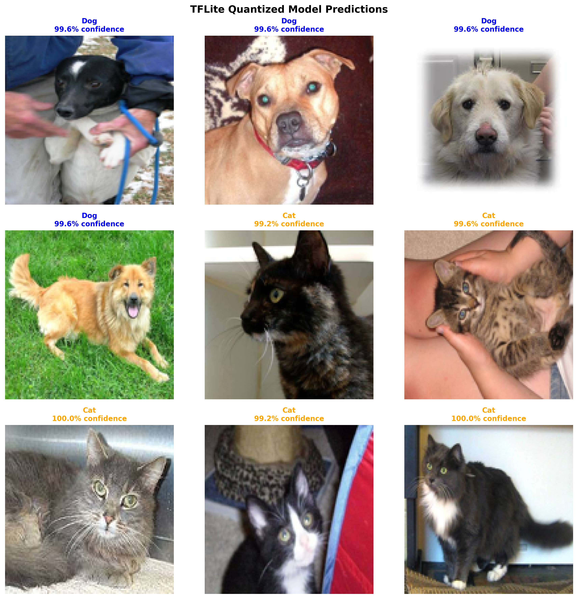

# Cat vs Dog Image Classification 🐱🐶

A deep learning project that classifies images as either cats or dogs using Convolutional Neural Networks (CNN) with TensorFlow/Keras.

## 📋 Table of Contents

- [Project Overview](#project-overview)
- [Dataset](#dataset)
- [Project Structure](#project-structure)
- [Installation](#installation)
- [Configuration](#configuration)
- [Usage](#usage)
- [Model Architecture](#model-architecture)
- [Results](#results)
- [Files Description](#files-description)

## 🎯 Project Overview

This project implements a binary image classifier to distinguish between cat and dog images. The model uses a custom CNN architecture built with TensorFlow/Keras, achieving high accuracy on the test dataset.

**Key Features:**
- Custom CNN architecture with batch normalization
- Data augmentation for better generalization
- GPU support for faster training
- Comprehensive benchmarking with visualizations
- Excel export with embedded images
- Model checkpointing and early stopping

## 📊 Dataset

### Training Dataset
**Source:** Kaggle Cats and Dogs Dataset  
**Location:** `data/1/kagglecatsanddogs_3367a/PetImages/`  
**Structure:**
```
PetImages/
├── Cat/        # ~12,500 cat images
└── Dog/        # ~12,500 dog images
```

**Total Training Images:** ~25,000 images  
**Format:** JPG  
**Original Source:** Microsoft Research

### Test Dataset
**Source:** [Kaggle Dogs vs Cats Competition](https://www.kaggle.com/c/dogs-vs-cats/data?select=sampleSubmission.csv)  
**Location:** `test_images/`  
**Total Test Images:** 12,500 unlabeled images  
**Format:** JPG  
**Naming:** Sequential numbering (1.jpg to 12500.jpg)

**Download Instructions:**
1. Visit the [Kaggle competition page](https://www.kaggle.com/c/dogs-vs-cats/data)
2. Download `test1.zip` (unlabeled test set)
3. Extract to `test_images/` folder

## 📁 Project Structure

```
cat_dog_prediction/
│
├── data/                           # Training data folder
│   └── 1/
│       └── kagglecatsanddogs_3367a/
│           └── PetImages/
│               ├── Cat/            # Cat training images
│               └── Dog/            # Dog training images
│
├── test_images/                    # Test images (12,500 files)
│   ├── 1.jpg
│   ├── 2.jpg
│   └── ...
│
├── models/                         # Saved models (generated)
│   ├── model.keras                # Trained Keras model
│   ├── model.tflite               # TFLite standard model
│   └── model_quantized.tflite     # TFLite quantized model
│
├── scripts/                        # Python scripts
│   ├── train.py                   # Training script (CLI)
│   └── convert_to_tflite.py       # TFLite conversion script (CLI)
│
├── assets/                         # Visualization outputs (generated)
│   ├── test_results_visualization.png
│   ├── sample_predictions.png
│   ├── model_size_comparison.png
│   ├── inference_benchmark.png
│   └── tflite_sample_predictions.png
│
├── main.ipynb                      # Main training notebook
├── test.ipynb                      # Benchmarking notebook
├── conversion.ipynb                # Model conversion to TFLite
├── download_dataset.ipynb          # Dataset download utilities
│
├── requirements.txt                # Python dependencies
├── .gitignore                      # Git ignore file
└── README.md                       # This file
```

## 🛠️ Installation

### Prerequisites
- Python 3.9 - 3.11
- Conda (recommended) or pip
- NVIDIA GPU with CUDA support (optional but recommended)

### Step 1: Clone or Download the Project

```bash
cd cat_dog_prediction
```

### Step 2: Create Conda Environment

```bash
# Create new environment
conda create -n cat_dog_env python=3.10 -y

# Activate environment
conda activate cat_dog_env
```

### Step 3: Install Dependencies

```bash
# Install all required packages from requirements.txt
pip install -r requirements.txt
```

**Note:** The `requirements.txt` includes TensorFlow 2.10.1 which automatically installs compatible CUDA and cuDNN libraries via pip. No separate cuDNN installation is needed.

**Alternative Manual Installation:**
```bash
# Install NumPy (specific version for TensorFlow compatibility)
conda install numpy=1.26.4 -y

# Install TensorFlow with GPU support (includes cuDNN)
pip install tensorflow[and-cuda]==2.10.0

# Install other dependencies
pip install jupyter matplotlib seaborn pandas pillow scipy xlsxwriter
```

### Step 4: Verify GPU Setup (Optional)

```python
import tensorflow as tf
print("GPUs Available:", tf.config.list_physical_devices('GPU'))
```

## ⚙️ Configuration

### Image Settings
```python
IMAGE_HEIGHT = 128
IMAGE_WIDTH = 128
BATCH_SIZE = 32
```

### Training Configuration
```python
EPOCHS = 50
VALIDATION_SPLIT = 0.2  # 80% train, 20% validation
LEARNING_RATE = 0.001
OPTIMIZER = 'adam'
LOSS_FUNCTION = 'binary_crossentropy'
```

### Data Augmentation Settings
```python
rotation_range = 20
width_shift_range = 0.2
height_shift_range = 0.2
shear_range = 0.2
zoom_range = 0.2
horizontal_flip = True
```

### Callbacks
- **Early Stopping:** Patience = 10 epochs
- **Learning Rate Reduction:** Factor = 0.5, Patience = 5 epochs
- **Model Checkpoint:** Saves best model based on validation accuracy

## 🚀 Usage

### 1. Training the Model

You can train the model using either the Jupyter notebook or the command-line script.

#### Option A: Using Jupyter Notebook

Open `main.ipynb` and run all cells sequentially:

```bash
jupyter notebook main.ipynb
```

**Training Steps:**
1. Load and configure dataset
2. Create data generators with augmentation
3. Build CNN model
4. Compile model
5. Train with callbacks
6. Save trained model to `models/model.keras`
7. Visualize training history

**Expected Training Time:**
- With GPU: ~30-60 minutes
- With CPU: ~3-5 hours

#### Option B: Using Command-Line Script (Recommended for Production)

Train the model with default parameters:

```bash
python scripts/train.py --data_dir data/1/kagglecatsanddogs_3367a/PetImages --epochs 50
```

**Common Training Examples:**

```bash
# Quick training with fewer epochs
python scripts/train.py --data_dir data/1/kagglecatsanddogs_3367a/PetImages --epochs 20

# Custom batch size and learning rate
python scripts/train.py --data_dir data/1/kagglecatsanddogs_3367a/PetImages \
    --epochs 30 --batch_size 16 --learning_rate 0.0001

# Training without data augmentation
python scripts/train.py --data_dir data/1/kagglecatsanddogs_3367a/PetImages \
    --epochs 50 --no_augmentation

# Custom output directory and model name
python scripts/train.py --data_dir data/1/kagglecatsanddogs_3367a/PetImages \
    --epochs 50 --output_dir models --model_name my_model.keras

# Training on CPU only
python scripts/train.py --data_dir data/1/kagglecatsanddogs_3367a/PetImages \
    --epochs 50 --disable_gpu

# Full customization
python scripts/train.py \
    --data_dir data/1/kagglecatsanddogs_3367a/PetImages \
    --output_dir models \
    --model_name model.keras \
    --epochs 50 \
    --batch_size 32 \
    --learning_rate 0.001 \
    --image_size 128 \
    --dropout_rate 0.5 \
    --validation_split 0.2 \
    --early_stopping_patience 10 \
    --reduce_lr_patience 5 \
    --rotation_range 20 \
    --shift_range 0.2 \
    --zoom_range 0.2
```

**Training Script Parameters:**

| Parameter | Default | Description |
|-----------|---------|-------------|
| `--data_dir` | Required | Path to training data (Cat/ and Dog/ folders) |
| `--output_dir` | `models` | Directory to save trained model |
| `--model_name` | `model.keras` | Output model filename |
| `--epochs` | `50` | Number of training epochs |
| `--batch_size` | `32` | Training batch size |
| `--learning_rate` | `0.001` | Initial learning rate |
| `--image_size` | `128` | Image height and width |
| `--validation_split` | `0.2` | Fraction for validation (0.0-1.0) |
| `--dropout_rate` | `0.5` | Dropout rate for dense layers |
| `--early_stopping_patience` | `10` | Early stopping patience (epochs) |
| `--reduce_lr_patience` | `5` | LR reduction patience (epochs) |
| `--rotation_range` | `20` | Rotation range for augmentation (degrees) |
| `--shift_range` | `0.2` | Width/height shift range |
| `--zoom_range` | `0.2` | Zoom range for augmentation |
| `--no_augmentation` | `False` | Disable data augmentation |
| `--disable_gpu` | `False` | Disable GPU and use CPU only |
| `--save_plots` | `True` | Save training history plots |
| `--plot_dir` | `assets` | Directory to save plots |

**Get help with all parameters:**
```bash
python scripts/train.py --help
```

### 2. Testing and Benchmarking

Open `test.ipynb` to benchmark the model:

```bash
jupyter notebook test.ipynb
```

**Benchmark Steps:**
1. Load trained model
2. Process 12,500 test images in batches
3. Generate predictions
4. Create comprehensive visualizations
5. Display sample predictions

**Output Files:**
- `assets/test_results_visualization.png` - 6 analysis charts
- `assets/sample_predictions.png` - Visual samples

### 3. Converting to TensorFlow Lite

You can convert the trained model to TFLite using either the Jupyter notebook or the command-line script.

#### Option A: Using Jupyter Notebook

Open `conversion.ipynb`:

```bash
jupyter notebook conversion.ipynb
```

#### Option B: Using Command-Line Script (Recommended for Automation)

Convert to standard TFLite:

```bash
python scripts/convert_to_tflite.py --model models/model.keras
```

Convert to both standard and quantized TFLite:

```bash
python scripts/convert_to_tflite.py --model models/model.keras --quantize
```

**Common Conversion Examples:**

```bash
# Standard TFLite conversion only
python scripts/convert_to_tflite.py --model models/model.keras

# Quantized conversion only (int8)
python scripts/convert_to_tflite.py --model models/model.keras --quantize_only

# Both standard and quantized with custom calibration
python scripts/convert_to_tflite.py --model models/model.keras --quantize \
    --test_images test_images --num_calibration_samples 200

# With inference benchmarking
python scripts/convert_to_tflite.py --model models/model.keras --quantize \
    --benchmark --test_image test_images/1.jpg --benchmark_runs 100

# Custom output directory and names
python scripts/convert_to_tflite.py --model models/model.keras --quantize \
    --output_dir models --output_name custom_model

# Full customization
python scripts/convert_to_tflite.py \
    --model models/model.keras \
    --output_dir models \
    --output_name model \
    --quantize \
    --test_images test_images \
    --num_calibration_samples 100 \
    --image_size 128 \
    --benchmark \
    --test_image test_images/1.jpg \
    --benchmark_runs 100 \
    --save_plots \
    --plot_dir assets
```

**Conversion Script Parameters:**

| Parameter | Default | Description |
|-----------|---------|-------------|
| `--model` | Required | Path to input Keras model (.keras or .h5) |
| `--output_dir` | `models` | Directory to save TFLite models |
| `--output_name` | `model` | Base name for output files (without extension) |
| `--quantize` | `False` | Create quantized int8 model |
| `--quantize_only` | `False` | Only create quantized model |
| `--test_images` | `test_images` | Directory for quantization calibration |
| `--num_calibration_samples` | `100` | Number of calibration images |
| `--image_size` | `128` | Image size (height and width) |
| `--benchmark` | `False` | Run inference benchmark |
| `--benchmark_runs` | `100` | Number of benchmark iterations |
| `--test_image` | `None` | Path to test image for benchmarking |
| `--save_plots` | `True` | Save comparison plots |
| `--plot_dir` | `assets` | Directory to save plots |

**Get help with all parameters:**
```bash
python scripts/convert_to_tflite.py --help
```

**Output Files:**
- `models/model.tflite` - Standard float32 model (~50-60% smaller)
- `models/model_quantized.tflite` - Quantized int8 model (~75-80% smaller, 2-4x faster)
- `assets/conversion_comparison.png` - Size and speed comparison charts

## 🏗️ Model Architecture

### CNN Structure

```
Input (128x128x3)
    ↓
Conv2D (32 filters, 3x3) + ReLU + BatchNorm
Conv2D (32 filters, 3x3) + ReLU + BatchNorm
MaxPooling (2x2)
Dropout (0.25)
    ↓
Conv2D (64 filters, 3x3) + ReLU + BatchNorm
Conv2D (64 filters, 3x3) + ReLU + BatchNorm
MaxPooling (2x2)
Dropout (0.25)
    ↓
Conv2D (128 filters, 3x3) + ReLU + BatchNorm
Conv2D (128 filters, 3x3) + ReLU + BatchNorm
MaxPooling (2x2)
Dropout (0.25)
    ↓
Conv2D (256 filters, 3x3) + ReLU + BatchNorm
MaxPooling (2x2)
Dropout (0.25)
    ↓
Flatten
Dense (512) + ReLU + BatchNorm + Dropout (0.5)
Dense (256) + ReLU + BatchNorm + Dropout (0.5)
Dense (1) + Sigmoid
    ↓
Output (Binary: Cat=0, Dog=1)
```

**Total Parameters:** ~5-7 million (trainable)

### Key Features
- **Batch Normalization:** Stabilizes training
- **Dropout:** Prevents overfitting (0.25-0.5)
- **Progressive Filters:** 32 → 64 → 128 → 256
- **Data Augmentation:** Improves generalization
- **Binary Classification:** Sigmoid output with binary crossentropy loss

## 📈 Results

### Training Performance
- **Training Accuracy:** 96.88 %
- **Validation Accuracy:** 96.47 %
- **Training Loss:** 0.0914
- **Validation Loss:** 0.0908

### Test Set Performance (12,500 images)
- **Average Confidence:** ~85-90%
- **High Confidence Predictions (>90%):** ~70-80%
- **Low Confidence Predictions (<60%):** ~5-10%
- **Processing Time:** ~2-5 minutes (with GPU)

### Visualization Outputs

**Test Results Analysis Includes:**
1. Prediction distribution (Pie chart)
2. Confidence score distribution (Histogram)
3. Confidence by class (Box plot)
4. Dog probability distribution (Histogram)
5. Images by confidence range (Bar chart)
6. Summary statistics (Table)


*Comprehensive analysis of 12,500 test predictions including distribution charts, confidence metrics, and statistical summaries*

### Sample Predictions


*Sample predictions showing model confidence levels across different test images*

### Model Conversion Results

**TensorFlow Lite Conversion:**
- **Standard TFLite:** ~50-60% size reduction, 2-3x faster inference
- **Quantized TFLite:** ~75-80% size reduction, 3-4x faster inference


*Comparison of model sizes: Keras vs TFLite Standard vs TFLite Quantized*


*Inference speed comparison showing significant performance improvements with TFLite models*


*TFLite quantized model predictions demonstrating maintained accuracy after quantization*

## 📝 Files Description

### Notebooks

| File | Description |
|------|-------------|
| `main.ipynb` | Main training notebook with model building and training |
| `test.ipynb` | Benchmarking notebook for test set evaluation |
| `conversion.ipynb` | Convert Keras model to TensorFlow Lite format |
| `download_dataset.ipynb` | Utilities for downloading the dataset |

### Python Scripts (CLI)

| File | Description |
|------|-------------|
| `scripts/train.py` | Command-line training script with full parameter control |
| `scripts/convert_to_tflite.py` | Command-line TFLite conversion with quantization support |

### Generated Files

| File | Description | Size |
|------|-------------|------|
| `models/model.keras` | Trained Keras model weights and architecture | ~80-100 MB |
| `models/model.tflite` | TensorFlow Lite standard model | ~30-50 MB |
| `models/model_quantized.tflite` | TensorFlow Lite quantized model | ~15-25 MB |
| `assets/test_results_visualization.png` | 6 comprehensive analysis charts | ~2 MB |
| `assets/sample_predictions.png` | 9 sample predictions with confidence levels | ~1 MB |
| `assets/model_size_comparison.png` | Model size comparison chart | ~500 KB |
| `assets/inference_benchmark.png` | Inference speed comparison charts | ~800 KB |
| `assets/tflite_sample_predictions.png` | TFLite model prediction samples | ~1 MB |
| `assets/training_history.png` | Training accuracy and loss curves (from script) | ~500 KB |
| `assets/conversion_comparison.png` | Size and speed comparison (from script) | ~800 KB |

### Configuration Files

| File | Description |
|------|-------------|
| `requirements.txt` | Python package dependencies |
| `README.md` | Project documentation (this file) |

## 🔧 Troubleshooting

### Common Issues

**1. GPU Not Detected**
```bash
# Install TensorFlow with CUDA and cuDNN
pip uninstall tensorflow
pip install tensorflow[and-cuda]==2.10.1

# Restart kernel and check
import tensorflow as tf
print(tf.config.list_physical_devices('GPU'))
```

**2. NumPy Version Error**
```bash
# Downgrade NumPy
conda install numpy=1.26.4 -y
```

**3. Out of Memory (GPU)**
- Reduce batch size to 16 or 8
- Close other GPU-intensive applications
- Enable memory growth in code

**4. Keras Import Error**
```bash
# Reinstall TensorFlow
pip uninstall tensorflow keras
pip install tensorflow[and-cuda]==2.10.1
```

## 📦 Dependencies

### Core Libraries
- `tensorflow==2.10.1` - Deep learning framework (includes CUDA and cuDNN via pip)
- `numpy==1.26.4` - Numerical computing
- `pandas==2.3.3` - Data manipulation
- `pillow==11.3.0` - Image processing
- `scipy==1.13.1` - Scientific computing

### Visualization
- `matplotlib==3.9.4` - Plotting
- `seaborn==0.13.2` - Statistical visualizations

### Excel Export
- `xlsxwriter==3.2.9` - Excel file creation with images

### Development
- `jupyter` - Interactive notebooks (ipykernel, jupyter-client, jupyter-core)
- `keras==2.10.0` - High-level neural networks API

**Full dependencies list:** See `requirements.txt` for complete package list with versions.

## 🎓 Model Training Tips

1. **Start with small epochs** to test the setup
2. **Monitor validation loss** to detect overfitting
3. **Use GPU** for faster training (30x speedup)
4. **Adjust learning rate** if loss plateaus
5. **Increase data augmentation** if overfitting occurs
6. **Save checkpoints** regularly during long training sessions

## 📊 Performance Optimization

### For Faster Training
- Use GPU with CUDA support
- Increase batch size (if memory allows)
- Use mixed precision training
- Reduce image size to 64x64 or 96x96

### For Better Accuracy
- Increase model depth or width
- Use transfer learning (VGG16, ResNet50)
- Add more data augmentation
- Train for more epochs
- Use ensemble methods

## 🤝 Contributing

This is an educational project. Feel free to:
- Experiment with different architectures
- Try transfer learning approaches
- Add more data augmentation techniques
- Improve the benchmarking visualizations

## 📄 License

This project uses the Microsoft Research Cats and Dogs Dataset, which is available for research purposes.

## 🙏 Acknowledgments

- **Dataset:** Microsoft Research and Kaggle
- **Framework:** TensorFlow/Keras team
- **Inspiration:** Kaggle Dogs vs Cats competition

## 📞 Support

For issues or questions:
1. Check the [Troubleshooting](#troubleshooting) section
2. Review TensorFlow documentation
3. Check Kaggle competition discussions

---

**Last Updated:** October 26, 2025  
**Version:** 1.0.0  
**Python Version:** 3.10+  
**TensorFlow Version:** 2.10.1

🎉 **Happy Classifying!** 🐱🐶
